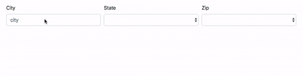

# Zip Web Client

Build a web client that uses your zip server to populate State and Zip `<select>` elements based on a city name that is entered by the user. To give you a more visual understanding of what I mean, here is what my solution looks like (uses Bootstrap, screen recorded on a Mac).

A few tips:

- Use the `"change"` event on the city input to catch when the user is done entering the city name. This event is triggered when the input looses focus. You can use `"input"` to respond to each keystroke, but that will generate a lot of requests that simply return null results.
- Remember that your server will respond with a JSON array of objects, each of which will have `code`, `city` and `state` properties.
- The same `state` may appear multiple times in the results, so you will need to populate the state `<select>` with just the distinct state names.
- Beware that if the city is not found, your server will return a JSON `null`, not an empty array.
